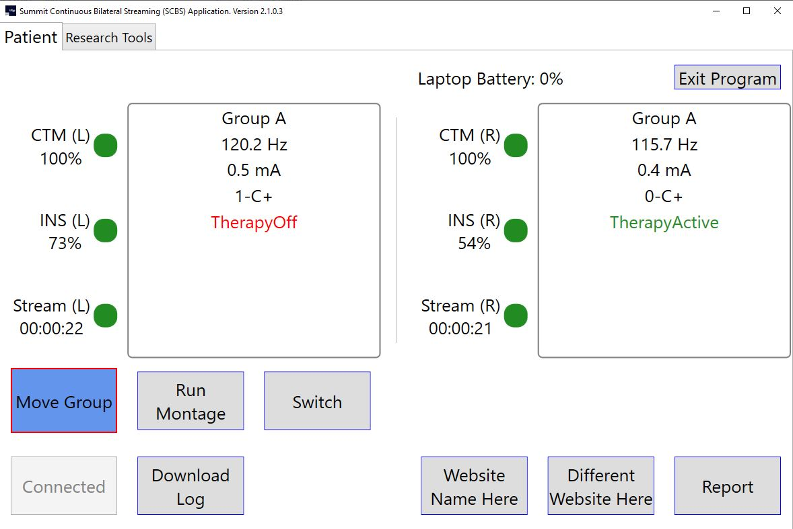

# SCBS

## README

 ### Video Tutorials
 [SCBS Setup Walkthrough](https://ucsf.box.com/s/i5eqns3jiiwsqcrliqtpfybophwwmg4j)
 
 [SCBS Config Files Walkthrough](https://ucsf.box.com/s/s12iiy0qyndnn1ziuigcg28jxu4d26tl)
 
 [SCBS Application Walkthrough](https://ucsf.box.com/s/znbk3ffso08xxtpl2deuqd8f8tr3ty60)

### Introduction

The main goal of this project is to provide a simple patient facing interface that will allow RC+S patients to easily stream neural data at home. This is important since developing any adaptive or “closed loop” protocol relies on both a large sample of training data and monitoring of algorithm performance. This should ideally occur in home setting over increasing timer periods. The current application does not change any parameters set on the INS (such as stim settings, stimulation group or sense settings) so long as the “Switch” functionality is turned off in the application_config.json file. Major parts of the code concern maintain a robust connection between the CTM and the INS. This includes automatic recovery of session connection both in cases in which the patient walks out of the room with computer or in which CTM/INS loose connectivity. Use of this code will allow continuous streaming during many activities of daily life and future versions will pair this recording with external monitors.

Currently these are the main barriers that impact successful continuous streaming at home:
 1. CTM battery life and “beeping”
 - CTM battery life on two AAA batteries is about 4-5 hours depending on settings. We have modified an external battery pack to plug into CTM. See plans here (TBD). With this addition, CTM can last > 50 hours.
 - The CTM beeps upon reconnection. This is very disruptive to sleep. We will need to submit an amendment to FDA to remove the speaker from the CTM.
 2. INS battery life
 - This is the current limitation. We can stream 4 TD channels, including therapeutic stim for about ~35 hours before INS battery runs down to 5%.
3. System bulk
 - Since system is based on windows based computers, it limits patient mobility with device. Currently, Surface Go’s and other small computers have been tested but different bluetooth chips perform differently so that this does not always work reliability. The only computer we have found consistently works is the
 - Microsoft Surface 4, we are looking into other computers as well and will update this list.
 
 The SCBS will run in unilateral (single INS) mode which will only communicate and connect with one INS or bilateral (2 INS’ implanted) mode which will communicate and connect to 2 CTM/INS pairs.  The functionality will change the UI and functionality accordingly when the “bilateral” variable is changed to true/false in the application_config.json file. 
 
 #### Bilateral Start/Unconnected:
 
 
 #### Bilateral Connection:
 

#### Unilateral Connection showing all buttons:


#### Report Screen:

There is a report window that allows the user/patient to report their symptoms/medications and additional comments and the time that this occurred.  This will log into the Medtronic Eventlog.json file.  This is useful for getting the state of the patient while they are streaming data.

The UI has information about what group the patient is in, how long they have been streaming, the INS/CTM/laptop battery levels, and stimulation data.  If the “Switch” functionality is turned off then the patient will be able to see what group, mA and Hz they are at.  If the “Switch” functionality is off then the patient will be able to only see their group whether Adaptive therapy is on.  There is also a stream coloring that will show when there is an issue with streaming.  If the light is green then the patient is streaming and if it is gray or flashing to gray then the streaming has stopped or is cutting out, respectively.

The SCBS is capable of making use of an “Align” functionality which will move from the current group to group B, then turn stim therapy on/off (based on what it is currently on), then on/off again, and then it will do that 2 more times leaving it in the original state stim therapy state that it was in originally.  Lastly, it will move it to group A.  The purpose of this is to align INS data points with artifacts.  When running in bilateral mode, the “align” will do this at almost the same time for both INS’ so that the clinician can have a sense of alignment between both INS’.  This will work as well in unilateral mode in case you need to add an artifact to the INS data to align to an outside device.

Inside the application_config.json there is an option to turn on the option to collect the log data from the INS that gives the adaptive state changes.  This is the option GetAdaptiveLogInfo.  There is also the option to get the Mirror log data that is stored on the INS as well.  This will give you how many times and for how long the patient has been in each adaptive state.  The variable to change to turn that on is GetAdaptiveMirrorInfo.  Both files get written inside of the current streaming session directory where the Medtronic .json files are stored.  They are both written out in a plain text file.
There is the ability to hide the report button and turn on the verbose logging for medtronic (which makes it easier for medtronic to debug issues). 

New Session button may be turned on and allows the patient to start a new session directory.. This disconnects the ctm(s)/ins(') and reconnects them which creates a new session directory for the Medtronic .json files for a fresh new set of files. 

There are 2 buttons that may be turned on to allow the user to open web pages. Each button's text may be edited along with each button's web page url. You can also force the user to be connected before they are able to open the web page.

There is ability to turn certain ctm beep noises on or off.  The most common setting is to have the ctm with no beeps, but if you would like the patient to know when their ins is disconnected from the ctm you can set that as well. Many other variations are also available.

There is a button that may be turned on to allow the user to move to a specific group.  This is used to quickly move them into a safe group if they are running adaptive therapy or if you just want a button that moves them into a specified "safe" group that is preprogrammed with the RLP. The button text may be edited and each ins side may have a specific group assigned.

Stim Sweep is a functionality that is coming soon that will allow the patient to run a config file that adjusts stim amp/pw/rate in a specified group and specified amount of time. 

There is a Montage functionality that will allow the patient to run multiple sense files one after another while recording data.  This requires a re-connection if already connected due to changing the Mode to 4 for optimal bandwidth. The instructions for the montage are customizable and the clinician can add as many montage sense files as they would like.  The time for each montage run is also customizable. The patient will get a total time for the entire montage and when running will get a progress status and timer countdown until finished.

Lastly there is the “Switch” functionality.  This is extremely important if you are trying to run a double-blind study and don’t want the patient to know if they are in adaptive or sham adaptive (open loop) mode.  The way this works is that there is a master switch config file that contains a list of adaptive config file names.  There is also an index corresponding to the current adaptive config file to run from the list.  When the patient clicks on the Switch button, the program will load the adaptive config file at the current index from the master switch config file.  This adaptive configuration will be configured on the patient’s INS.  If the patient is running in bilateral mode, then it will update both INS’ at the same time.  This requires that you have a separate directory for the other side with its own master config file and list of adaptive files.  Once the patient is finished updating their INS’, the current adaptive file(s) will be written into the current Medtronic session directory and the master config file(s) will be updated with the next index so that the next adaptive file can run the next time.  A cool feature is that you can turn on the ability to prevent the patient from running the switch functionality more that once in a specific amount of time.  This helps in case a patient forgets that they have already ran the switch for that day and try to run it again within the minimum time frame allowed by the clinician.  Turning on the feature is done by changing the WaitTimeIsEnabled to true and setting the WaitTimeInMinutes to the minimum number of minutes the patient must wait before being able to run Switch again.

## User Guide

### Step 1: Setup ORCA Keys
In order to begin installation, you will need to follow the instructions in the Research Development Kit Manual(RDKM) to setup your ORCA keys (or bypass them depending on Medtronic direction).  The instructions can be found on page 19.  

### Step 2: Setup Visual Studio
You will also need to setup Visual Studio.  The instructions for this can be found on page 24.  Setting up Visual Studio involves setting up the CPU and the .dll files for Medtronic.  

### Step 3: Config Files
The program gets its configurations from .json files.  In order to run the program, you will need to add these configuration files into the correct directory locations and in the correct format.  

#### Application Config
The first config file is the application config file.  It needs to be in the directory C:\\SCBS\\application_config.json. The format for this is:
```
{
	"comment": "true if it is bilateral or false if it is unilateral. Switch to true to show switch which allows setting the embedded adaptive. Align to true if you want the align button visible set to true, this moves to group b, turn stim on/off 4 times and moves to group A. Montage Sense sweep button visible to true. New session creates new session folder for medtronic json files. Get adaptive log info gets onboard application state changes. Get mirror data gets the onboard mirror log data. log beep event logs an event in EventLog.json every time it hears a noise in the microphone to align with tasks.",
	"BasePathToJSONFiles": "C:\\ProgramData\\Medtronic ORCA",
	"Bilateral": false,
	"Switch": false,
	"Align": false,
	"Montage": false,
	"NewSession": false,
	"HideReportButton": false,
	"GetAdaptiveLogInfo": false,
	"GetAdaptiveMirrorInfo": false,
	"LogBeepEvent": false,
	"CTMBeepEnables": {
		"comment": "lets you choose what CTM Beeps you want enabled",
		"None": true,
		"GeneralAlert": false,
		"TelMCompleted": false,
		"DeviceDiscovered": false,
		"NoDeviceDiscovered": false,
		"TelMLost": true
	},
	"WebPageButtons": {
		"comment": "URL for webpage to open and if you want the button enabled and button text",
		"OpenWithoutBeingConnected": true,
		"WebPageOneButtonEnabled": false,
		"WebPageOneURL": "https://www.google.com",
		"WebPageOneButtonText": "Adaptive Report",
		"WebPageTwoButtonEnabled": false,
		"WebPageTwoURL": "https://www.microsoft.com",
		"WebPageTwoButtonText": "Motor Diary"
	},
	"MoveGroupButton": {
		"comment": "Allows you to move a specified group. GroupToMoveTo must be in format 'A', 'B', etc.  If a single INS, then use GroupToMoveToLeftUnilateral regardless of left or right",
		"MoveGroupButtonText": "Adaptive OFF",
		"MoveGroupButtonEnabled": false,
		"GroupToMoveToLeftUnilateral": "C",
		"GroupToMoveToRight": "C"
	}
}
```
- BasePathToJSONFiles is the base path where the medtronic json files will be written to. This should be the same as the SummitRegWithoutORCA.reg file on the line: "DataDirectory"="**C:\\\\ProgramData\\\\Medtronic ORCA**". This ensures that when the switch config files and the mirror log and event log files are written in the current session directory.
- Set bilateral to true if bilateral else false for unilateral
- Switch to true if you would like the Switch button to be present
- Align if you would like to use the align functionality
- GetAdaptiveLogInfo on if you would like to get the adaptive state changes from the INS onboard log
- GetAdaptiveMirrorInfo if you would like to get how long and how many times a state has been entered (for embedded adaptive). 
- Set LogBeepEvent to log an event into the Medtronic eventlog.json file any time the microphone hears a sound over a certain dB. You must plug your device into the mic before starting the program for it to register. This is good for aligning another task with the RC+S.
- There is also the option to turn on different beeps for the CTM. Change any of the to true for that specific beep or None for no beep.
- The WebPageButtons allows you to enable 2 different buttons or just one of the buttons at a time.  You can customize the button text and what web site it will take the user to. The user must be connected to their INS and CTM for the buttons to work.

#### Sense Config
The next config files are used for sensing.  You will need to put both of these files in the location C:\\SCBS\\senseLeft_config.json and C:\\SCBS\\senseRight_config.json.  You will need both of these even if you aren't doing bilateral. If you are using just unilateral, then you will be using the senseLeft_config.json as your sense config file.  This is the standard default config file.  Both left and right config files have the same format:

```
{
  "eventType": {
    "comment": "event name to use to log to .json files",
    "type": "Home streaming"
  },
  "Mode": 3,
  "Ratio": 32,
  "SenseOptions": {
    "comment": "lets you set what to sense",
    "TimeDomain": true,
    "FFT": true,
    "Power": true,
    "LD0": true,
    "LD1": false,
    "AdaptiveState": true,
    "LoopRecording": false,
    "Unused": false
  },
  "StreamEnables": {
    "comment": "lets you set what to stream",
    "TimeDomain": true,
    "FFT": false,
    "Power": true,
    "Accelerometry": false,
    "AdaptiveTherapy": false,
    "AdaptiveState": false,
    "EventMarker": false,
    "TimeStamp": true
  },
  "Sense": {
    "commentTDChannelDefinitions": "No more than two channels can be on a single bore. When configuring, channels on first bore will always be first. Can only have sampling rates of: 250, 500, and 1000 (Hz) or disable it by setting IsDisabled to true",
    "commentFilters": "Stage one low pass(Lpf1) can only be: 450, 100, or 50 (Hz). Stage two low pass(Lpf2) can only be: 1700, 350, 160, or 100 (Hz). High pass(Hpf) can only be: 0.85, 1.2, 3.3, or 8.6 (Hz), Inputs[ anode(positive), cathode(negative) ]",
    "TDSampleRate": 250,
	"TimeDomains": [
	  {
		"ch0": "STN",
		"IsEnabled": true,
		"Hpf": 0.85,
		"Lpf1": 100,
		"Lpf2": 100,
		"Inputs": [ 0, 2 ]
	  },
	  {
		"ch1": "STN",
		"IsEnabled": true,
		"Hpf": 0.85,
		"Lpf1": 100,
		"Lpf2": 100,
		"Inputs": [ 1, 3 ]
	  },
	  {
		"ch2": "M1",
		"IsEnabled": true,
		"Hpf": 0.85,
		"Lpf1": 450,
		"Lpf2": 1700,
		"Inputs": [ 8, 10 ]
	  },
	  {
		"ch3": "M1",
		"IsEnabled": true,
		"Hpf": 0.85,
		"Lpf1": 450,
		"Lpf2": 1700,
		"Inputs": [ 9, 11 ]
	  }
	],
    "FFT": {
      "commentFFTParameters": "FFT Size can be: 64, 256, or 1024 samples, Hanning window load can be: 25, 50, or 100 (%), channel is for the fft channel must be between 0-3 and time domain must be enabled for that channel",
      "Channel": 1,
      "FftSize": 1024,
      "FftInterval": 100,
      "WindowLoad": 100,
      "StreamSizeBins": 0,
      "StreamOffsetBins": 0,
	  "WindowEnabled": true
    },
	"commentPower": "each power band can be set from 0-250hz, 2 pos bands per channel. Ex: ChNPowerBandN:[lower, upper]",
    "PowerBands": [
		{
			"comment": "Channel: 0 PowerBand: 0",
			"ChannelPowerBand": [ 18, 22 ],
			"IsEnabled": true
		},
		{
			"comment": "Channel: 0 PowerBand: 1",
			"ChannelPowerBand": [ 10, 12 ],
			"IsEnabled": true
		},
		{	
			"comment": "Channel: 1 PowerBand: 0",
			"ChannelPowerBand": [ 6, 7 ],
			"IsEnabled": false
		},
		{
			"comment": "Channel: 1 PowerBand: 1",
			"ChannelPowerBand": [ 6, 7 ],
			"IsEnabled": false
		},
		{
			"comment": "Channel: 2 PowerBand: 0",
			"ChannelPowerBand": [ 6, 7 ],
			"IsEnabled": true
		},
		{
			"comment": "Channel: 2 PowerBand: 1",
			"ChannelPowerBand": [ 6, 7 ],
			"IsEnabled": false
		},
		{
			"comment": "Channel: 3 PowerBand: 0",
			"ChannelPowerBand": [ 6, 7 ],
			"IsEnabled": false
		},
		{
			"comment": "Channel: 3 PowerBand: 1",
			"ChannelPowerBand": [ 6, 7 ],
			"IsEnabled": false
		}
    ],
    "Accelerometer": {
      "commentAcc": "Can be 4,8,16,32,64Hz or set SampleRateDisabled to true for disabled",
      "SampleRateDisabled": false,
      "SampleRate": 64
    },
	"Misc": {
      "commentMiscParameters": "stream rate can be 30-100 by tens and is in ms; LoopRecordingTriggersState can be 0-8 or can be disabled by changing IsEnabled to false; Bridging can be 0 = None, 1 = Bridge 0-2 enabled, 2 = Bridge 1-3 enabled",
      "StreamingRate": 50,
      "LoopRecordingTriggersState": 0,
	  "LoopRecordingTriggersIsEnabled": true,
      "LoopRecordingPostBufferTime": 53,
      "Bridging": 0
    }
  }
}
```
NOTE: There is a method in MainImplementationViewModel.cs named CheckPacketLoss(). This method is used to check if the sense settings from the sense config file will run above the desired bandwidth causing major packet loss.  If the check comes back that it is over this limit, then it will report this to the user.

#### Report Config
You will need a report config file. This is used so the patient can report symptoms or medications.  You can add as many medications and symptoms as you'd like.  This config file will also be in the C:\\SCBS\\ directory and needs to be named report_config.json.  The report_config.json template file is:

```
{
	"comment": "List of medications and symptoms for Report Window to user",
	"Medications": [
		"medicine1",
		"medicine2",
		"medicine 3"
	],
	"Symptoms": [
		"Feeling 'on' little / no symptoms",
		"Balance and posture",
		"Slowness of Movement",
		"Dyskinesia",
		"Dystonia",
		"Rigidity (Muscle Stiffness)",
		"Speech",
		"Tremor",
		"Mania",
		"Inappropriate Sleepiness"
	]
}
```

#### Montage Config
The montage config will be located in the directory C:\\SCBS\\Montage\\montage_config.json and must be named montage_config.json. The sense files (shown above with the same format) used by the montage to run must be located in the same directory as the montage_config.json file.  They may be named anything but only the name of the sense file (and not the .json) must be added in the montage_config.json file. So the example montage_config.json file below would have 5 sense config files in the same directory named config1.json, config2.json, config3.json, config4.json, and config5.json.  The TimeToRunInSeconds is how long each will take to run. There is an event marker that will be logged in the Medtronic json eventlog file that will log when the montage started, 5 seconds after the start of each montage, 5 seconds before the current montage ends and the end of the entire montage.  The 5 seconds buffer is to allow for artifacts after chaning sense setting to not be included. The Instructions are customizable and will appear to the user before starting the montage. 

```
{
	"comment": "List of config files and times to run each one for Montage sweep",
	"Instructions": "This is where the instructions for the patient go",
	"MontageFiles": [
	  {
		"Filename": "config1",
		"TimeToRunInSeconds": 40
	  },
	  {
		"Filename": "config2",
		"TimeToRunInSeconds": 40
	  },
	  {
		"Filename": "config3",
		"TimeToRunInSeconds": 40
	  },
	  {
		"Filename": "config4",
		"TimeToRunInSeconds": 40
	  },
	  {
		"Filename": "config5",
		"TimeToRunInSeconds": 40
	  },
	]
}
```

#### Switch Config using Adaptive Config
Lastly, if you plan to use the Switch functionality, you will need to add the master switch config files for left (default if unilateral) and right.  The left goes in the directory C:\\SCBS\\switch\\left_default\\switch_left_default.json and C:\\SCBS\\switch\\right\\switch_right.json.  These are the master files and will be used to find out which adaptive file to run next for each side repectively.  The format is the same for both sides:

```
{
	"Comment": "CurrentIndex starts at 0 and will load the index config file in ConfigNames.  ConfigNames contains just the names of the config files to load.  Do not include the .json ext or the directory path.  Each config file needs to go in C:\\SCBS\\switch\\left_default\\switch_left_default.json or C:\\SCBS\\switch\\right\\switch_right.json directory. DateTimeLastSwitch is in UTC time and is the last time the switch was ran. Use WaitTimeInMinutes to adjust the next time the user is able to run switch again and WaitTimeIsEnabled to enable it.",
	"DateTimeLastSwitch": "10/2/2019 7:25:01 PM",
	"WaitTimeInMinutes": 5,
	"WaitTimeIsEnabled": true,
	"CurrentIndex": 1,
	"ConfigNames": [
		"config1",
		"config2",
		"config1",
		"config1"
	]
}
```
For this example, you will need 2 adaptive config files in the same directory as the master config file named config1.json and config2.json.  The adaptive config files have the format:

```
{
	"Comment": "config file for the adaptive DBS configurations",
	"Detection":{
		"LD0": {
			"Comment": "Detection settings for LD0",
			"B0": 1000,
			"B1": 6000,
			"UpdateRate": 5,
			"OnsetDuration": 0,
			"TerminationDuration": 0,
			"HoldOffOnStartupTime": 1,
			"StateChangeBlankingUponStateChange": 2,
			"FractionalFixedPointValue": 0,
			"DualThreshold": true,
			"BlankBothLD": false,
			"Inputs": {
				"Ch0Band0": true,
				"Ch0Band1": false,
				"Ch1Band0": false,
				"Ch1Band1": false,
				"Ch2Band0": false,
				"Ch2Band1": false,
				"Ch3Band0": false,
				"Ch3Band1": false
			},
			"WeightVector": [1,0,0,0],
			"NormalizationMultiplyVector": [1,0,0,0],
			"NormalizationSubtractVector": [0,0,0,0]
		},
		"LD1": {
			"Comment": "Detection settings for LD1",
			"IsEnabled": false,
			"B0": 1000,
			"B1": 6000,
			"UpdateRate": 5,
			"OnsetDuration": 0,
			"TerminationDuration": 0,
			"HoldOffOnStartupTime": 1,
			"StateChangeBlankingUponStateChange": 2,
			"FractionalFixedPointValue": 0,
			"DualThreshold": true,
			"BlankBothLD": false,
			"Inputs": {
				"Ch0Band0": true,
				"Ch0Band1": false,
				"Ch1Band0": false,
				"Ch1Band1": false,
				"Ch2Band0": false,
				"Ch2Band1": false,
				"Ch3Band0": false,
				"Ch3Band1": false
			},
			"WeightVector": [1,0,0,0],
			"NormalizationMultiplyVector": [1,0,0,0],
			"NormalizationSubtractVector": [0,0,0,0]
		}
	},
	"Adaptive": {
		"Program0": {
			"Comment": "Rise_fall times how long it takes to ramp up or down. If stat is unused, set to 25.5",
			"RiseTimes": 6500,
			"FallTimes": 6500,
			"RateTargetInHz": 100,
			"State0AmpInMilliamps": 1,
			"State1AmpInMilliamps": 1,
			"State2AmpInMilliamps": 1,
			"State3AmpInMilliamps": 25.5,
			"State4AmpInMilliamps": 25.5,
			"State5AmpInMilliamps": 25.5,
			"State6AmpInMilliamps": 25.5,
			"State7AmpInMilliamps": 25.5,
			"State8AmpInMilliamps": 25.5
		}
	}	
}
```

### Step 4: Auto-Updater (optional)

There is an auto-update feature which uses the library AutoUpdater.NET. The location of this library is here: https://github.com/ravibpatel/AutoUpdater.NET. To use this functionality, you must include a file named **url.txt** in the path C:\\SCBS\\url.txt.  This file should only contain a url string.  This url will be used to locate the xml file for updates, as per the library. The xml file will be in the format: 
```
<?xml version="1.0" encoding="UTF-8"?>
<item>
    <version>1.0.0.0</version>
    <url>https://url_where_update_is_stored/SCBS.zip</url>
    <mandatory mode="2">true</mandatory>
</item>
```
If the version number has increased in the xml file, then the auto-update will be launched.  If not, or if there isn't a proper url in the url.txt or the url.txt is missing, then the update will not occur.

After auto-update is all setup, you may update the application.  To do so, you will need to increment the AssemblyVersion number in your AssemblyInfo.cs in your program. Build your Release version of your program after incrementing your Assembly version.  You will then need to zip the *release* directory of the application (all the files in the directory and not the directory itself).  You may call it whatever you like, but it must be the same as what is in your xml file.  I called mine SCBS.zip (as shown above in xml file example).  You will then need to edit the xml file so that the version number is the same as the version you incremented in your AssemblyVersion.  Upload the xml file to the location (server, cloud, etc) of the url in your url.txt file.  Upload the .zip file to the location stated in your xml file.  After this is done, the next time the program is run, the user will be prompted to update the application.

### Logging

There is application logging throughout the program.  This uses Caliburn Micro Log4Net logging.  The logs can be found in C:\\SCBS\\logs and a log file will be created every time a user starts the program and keeps logging in that same file until the user clicks the Exit button.

### Contact

Randy Perrone (Software Engineer) randy.perrone@ucsf.edu **or** Ro'ee Gilron (Project Manager) roee.gilron@ucsf.edu

