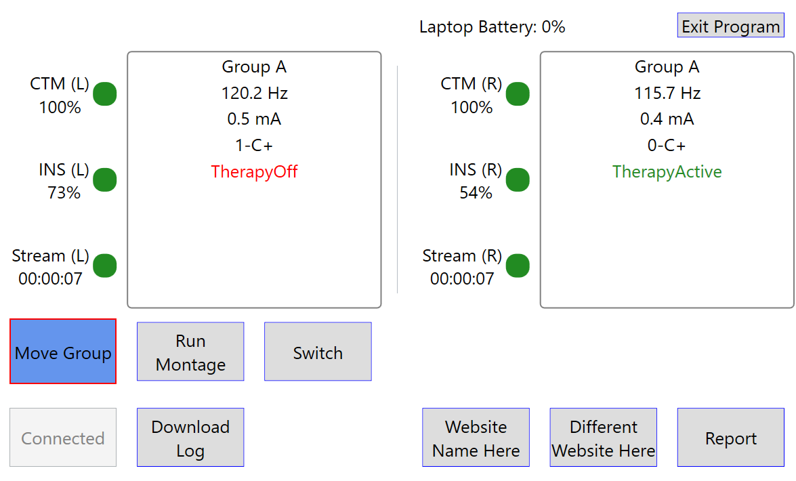
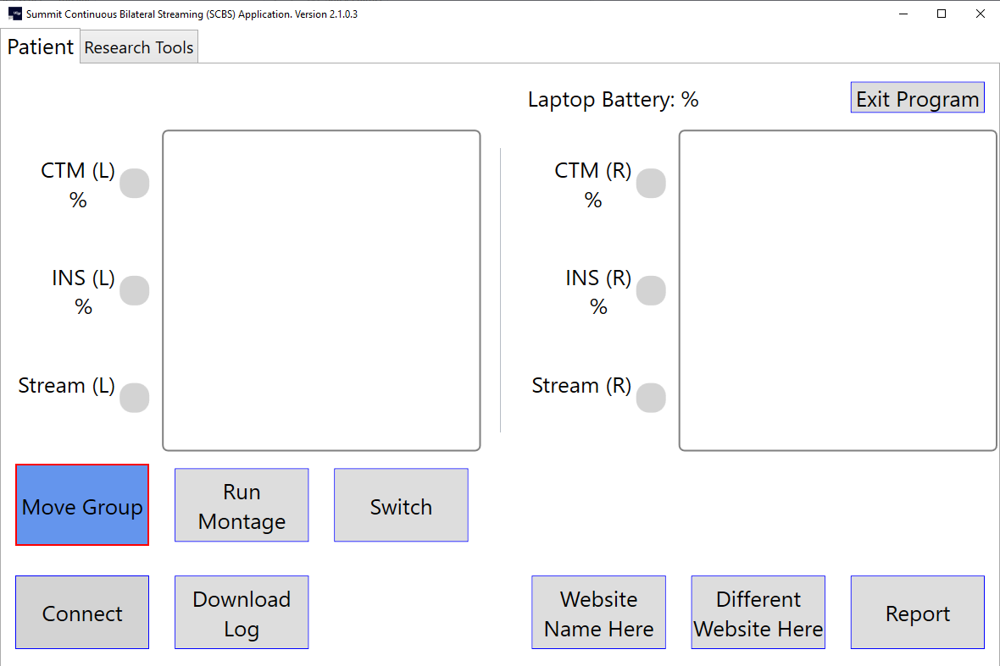
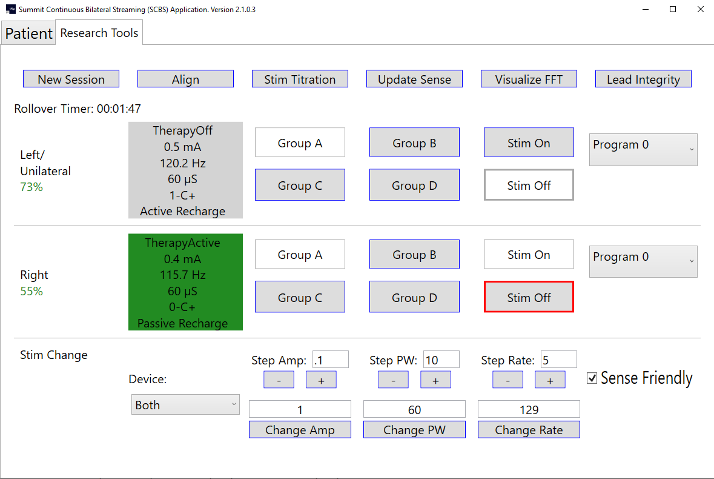
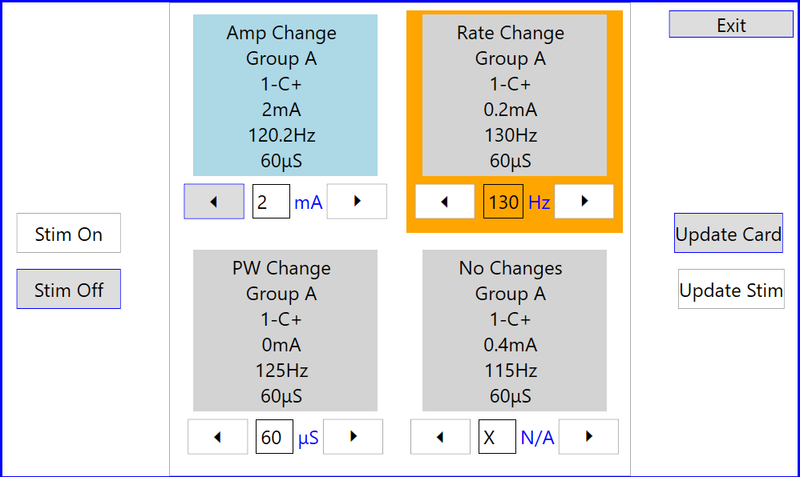

# SCBS

## README

 ### Video Tutorials
Please click on the link below to view the tutorial video in your web browser. You can also download the video to your computer by clicking any of the 'download here' urls. You will see a download button on the screen where you can download the tutorial video. Additionally, you can just download the .zip file for the code and open the tutorials folder and you will find all video walkthroughs there.
 
  [SCBS Setup Walkthrough](https://ucsf.box.com/s/1ecvfteyruaskojo8ol55hugwl6pw2g6) or [download here](tutorials/SCBSApplicationSetup.mp4)
 
  [SCBS Config Files Walkthrough](https://ucsf.box.com/s/vggrp7h80lj53wcrs5lw7mehnaclgnm1) or [download here](tutorials/SCBSConfigFileWalkthrough.mp4)
 
  [SCBS Application Walkthrough](https://ucsf.box.com/s/sx47s0knn9ucvvax2qpr5wk2js0m0ulq) or  [download here](tutorials/SCBSApplicationWalkthrough.mp4)
 
  [SCBS Montage/Switch Setup and Walkthrough](https://ucsf.box.com/s/6j8j1mkdcpm8mj0l91v7aihlwhd6itla) or  [download here](tutorials/SCBSMontageSwitchSetupWalkthrough.mp4)
 
  [SCBS Patient Stim Change Walkthrough](https://ucsf.box.com/s/19s6cygq2ciyro8pm29xgxbcchsw1iaf) or  [download here](tutorials/SCBSPatientStimWalkthrough.mp4)

### Introduction

The main goal of this project is to provide a simple patient facing interface that will allow RC+S patients to easily stream neural data at home. This is important since developing any adaptive or “closed loop” protocol relies on both a large sample of training data and monitoring of algorithm performance. This should ideally occur in home setting over increasing time periods. The current application is completely customizable from the most basic version with just a Connect and Exit button that will only let the patient stream, to customizations that allow patients to change their own stim and researcher tools that allow researchers to control stim settings, group changes, stim sweeps, etc. Major parts of the code concern maintain a robust connection between the CTM and the INS. This includes automatic recovery of session connection both in cases in which the patient walks out of the room with computer or in which CTM/INS lose connectivity. Use of this code will allow continuous streaming during many activities of daily life.
 ### Application
The SCBS will run in unilateral (single INS) mode which will only communicate and connect with one INS or bilateral (2 INS’ implanted) mode which will communicate and connect to 2 CTM/INS pairs.  The functionality will change the UI and functionality accordingly when the “bilateral” parameter is changed to true/false in the application_config.json file.  

**Very Important: If running bilateral, the INS' must be named correctly with the RLP. The left side must be named with an 'L' at the end and the right side must be named with an 'R' at the end (ie: Patient01L/Patient01R, 01L/01R, etc). They must be capital 'L' and 'R' and must be at the end. The rest of the name can be anything and any length allowable by RLP.** 
 
  #### Patient Screen (researcher tools disabled):
 
 
 #### Bilateral Start/Unconnected (researcher tools enabled):
 
 
 #### Bilateral Connection:
 

#### Unilateral Connection:


#### Researcher Tools:


#### Report Screen:

There is a report window that allows the user/patient to report their symptoms/medications and additional comments and the time that this occurred.  This will log into the Medtronic Eventlog.json file.  This is useful for getting the state of the patient while they are streaming data.

#### Patient Stim Control:


### Application Functionality Overview
With the application_config.json file, you can customize the application to your needs. You can enable/disable most buttons, hide stim display settings, change unilateral/bilateral, or turn on certain functionalities on connection.  More about the application_config later in this readme.

#### Patient Screen Functionality
1. The UI has information about what group the patient is in, how long they have been streaming, the INS/CTM/laptop battery levels, and stimulation data (amp, rate, contacts, therapy on/off, Adaptive on).  
    - The app can be customized to hide stim display settings for patients that are blinded. You can hide group and all stimulation data (as detailed above) from the user. 
    - There is a stream coloring that will show when there is an issue with streaming.  If the light is green then the patient is streaming and if it is gray or flashing to gray then the streaming has stopped or is cutting out, respectively. There is also the stream timer that will stop when streaming has stopped.

2. The app can download the onboard INS logs either automatically at initial connection or with a button that is enabled that will allow the user to download the logs at any time they are connected. There are 3 different logs: App(Adaptive) logs, Event logs and Mirror logs.  The App logs get the adaptive state changes and other various info. The Event logs get group changes, therapy changes and other various info. And the Mirror logs will give you how many times and for how long the patient has been in each adaptive state.  To enable downloading of logs on initial startup for App, Event and Mirror, you can set the parameters in the application_config.json for GetAdaptiveLogInfo, GetEventLogInfo and GetAdaptiveMirrorInfo, respectively. You can also enable a button for the user to download the logs at any time by setting the LogDownloadButton object parameters which allow you to change button text, enable button and set which logs you would like to download when the user clicks the button. 
    - All files get written inside of the current streaming session directory where the Medtronic .json files are stored.  They are all written out in a plain text file.
    - Note: On automatic log download, the CTM and INS show that both have connected but the streaming has not started.  A spinner will run the entire time that the logs are being downloaded which may look like there are connection issues, but it is just downloading the logs. To verify, the user will see a flashing green light on their CTM while the logs are downloading.  The spinner will stop and streaming will start after logs have downloaded.

3. There are 2 buttons that may be turned on to allow the user to open web pages. Each button's text may be edited along with each button's web page url. You can also force the user to be connected before they are able to open the web page.  This helps if they have a report or a task on a webpage and you want them to be streaming.

4. There is the ability to turn certain ctm beep noises on or off.  The most common setting is to have the ctm with no beeps, but if you would like the patient to know when their ins is disconnected from the ctm you can set that as well. Many other variations are also available.

5. There is a button that may be turned on to allow the user to move to a specific group.  This is used to quickly move them into a safe group if they are running adaptive therapy or if you just want a button that moves them into a specified "safe" group that is preprogrammed with the RLP (or just to move to a group for any reason). The button text may be edited and each INS side may have a specific group assigned.

6. There is a Montage functionality that will allow the patient to run multiple sense files one after another while recording data.  This requires a re-connection if already connected due to changing the Mode to 4 for optimal bandwidth. The instructions for the montage are customizable and the clinician can add as many montage sense files as they would like.  The time for each montage run is also customizable. The patient will get a total time for the entire montage and when running will get a progress status and timer countdown until finished.  One thing to note is that if therapy is on, then the app will check if contacts 0-3 and 8-11 are providing stim. If they are, then the lfp1 and lfp2 will get set automatically to 100.

7. There is the “Switch” functionality.  This is extremely important if you are trying to run a double-blind study and don’t want the patient to know if they are in adaptive or sham adaptive (open loop) mode.  The way this works is that there is a master switch config file that contains a list of adaptive config file names.  There is also an index corresponding to the current adaptive config file to run from the list.  When the patient clicks on the Switch button, the program will load the adaptive config file at the current index from the master switch config file.  This adaptive configuration will be configured on the patient’s INS.  If the patient is running in bilateral mode, then it will update both INS’ at the same time.  This requires that you have a separate directory for the other side with its own master config file and list of adaptive files.  Once the patient is finished updating their INS’, the current adaptive file(s) will be written into the current Medtronic session directory and the master config file(s) will be updated with the next index so that the next adaptive file can run the next time.  A cool feature is that you can turn on the ability to prevent the patient from running the switch functionality more that once in a specific amount of time.  This helps in case a patient forgets that they have already ran the switch for that day and try to run it again within the minimum time frame allowed by the clinician.  Turning on the feature is done by changing the WaitTimeIsEnabled to true and setting the WaitTimeInMinutes to the minimum number of minutes the patient must wait before being able to run Switch again.

8. There is the ability to run a Lead Integrity test on connection. This will run the monopolar and bipolar conctacts and print them in the medtronic EventLog.json file. There is also the ability to turn a button on for researchers to run it any time they would like in the Resarch Tools tab.

9. There is the ability to hide the report button. You can hide all the button's from the user besides the Connect and Exit buttons. 

10. The patient stim control allows patients to control certain stimulation settings.  The researcher beforehand sets up the patient_stim_config file for the left/unilateral and right sides.  There are 4 cards allowed for the patient to choose from.  Each card allows the patient to adjust one stim type (amp,rate,pw or no stim changes).  The allowable settings are set by the researcher, so the patient may only go to the allowable stim settings (so if amp is set to (0,1,1.5) then those are the only values the patient can adjust to). The cards can be set to be different groups or all the same group with different stim types (amp, rate, pw, none). Cards can be hidden as well, so the patient may either have 1 card to adjust or all 4 to choose from. The patient may turn stim on or off if the buttons are enabled by the researcher.  See video tutorial for more information and below for config file instructions.

#### Researcher Tools Screen Functionality (only available if Researcher tools flag is turned on in application_config.json)
The researcher tools allow researchers to adjust the stimulation for the patient, change groups, turn therapy on/off and run other researcher tools (explained below) with a click of the button. This works for unilateral or bilateral and will adjust the UI accordingly to each setting. When the rearcher tools flag is turned off in the application_config.json, then the patient will not have any access to this functionality or even know that it is there (it is hidden from them).
    
 - Note if the researcher is adjusting stim settings, there is a setting from the dropdown menu named Both when running bilaterally. This will adjust the setting on the left device followed automatically by the right device. You may also just choose to adjust the Left or Right devices separately.

1. The SCBS is capable of making use of an “Align” functionality which will move from the current group to group B, then turn stim therapy on/off (based on what it is currently on), then on/off again, and then it will do that 2 more times leaving it in the original state stim therapy state that it was in originally.  Lastly, it will move it to group A.  The purpose of this is to align INS data points with artifacts.  When running in bilateral mode, the “align” will do this at almost the same time for both INS’ (left first then  immediately followed by right) so that the clinician can have a sense of alignment between both INS’.  This will work as well in unilateral mode in case you need to add an artifact to the INS data to align to an outside device.

2. New Session button may be turned on and allows the researcher to start a new session directory.. This disconnects the ctm(s)/ins(') and reconnects them which creates a new session directory for the Medtronic .json files for a fresh new set of files. 

3. Stim Sweep is a functionality that allows the researcher to run a preconfigured set of stim settings on the device.  There is a config file that is used to adjust stim amp/pw/rate in a specified group/program and specified amount of time in ms. 

4. FFT Viewer allows the researcher to visualize the FFT stream in real time.  You will need to get a SciChart licence for this to work. They are free for researchers. See SciChart license towards end of readme for instructions.

5. Update Sense button will reload the sense files for left and if bilateral, right sense_config files. The button will disable while loading and reenable when finished. Streaming will automatically restart.

6. If you hover your mouse over the stim display settings, it will read out the upper and lower limits for of the amp, rate and pulse width.
7. The rollover timer resets when the amp settings have changed or there is a new session.

## User Guide

### Step 1: Setup ORCA Keys
In order to begin installation, you will need to follow the instructions in the Research Development Kit Manual(RDKM) to setup your ORCA keys (or bypass them depending on Medtronic direction).  The instructions can be found on page 19.  

### Step 2: Setup Visual Studio
You will also need to setup Visual Studio.  The instructions for this can be found on page 24.  Setting up Visual Studio involves setting up the CPU and the .dll files for Medtronic.  

### Step 3: Config Files
The program gets its configurations from .json files.  In order to run the program, you will need to add these configuration files into the correct directory locations and in the correct format.  You may quickly copy all of the updated config files from here:  [Config Files](https://github.com/openmind-consortium/App-SCBS-PatientFacingApp/tree/master/SCBS/bin/x64/Release/Auto_Update_Report/current_config_files)

#### Application Config
The first config file is the application config file.  It needs to be in the directory C:\\SCBS\\application_config.json. The format for this is:
```
{
{
	"comment": "true if it is bilateral or false if it is unilateral. Switch is true if you want the switch tab functionality or false if you do not. Set align to true if you want the align button visible, you must have bilateral set true for this to work",
	"BasePathToJSONFiles": "C:\\ProgramData\\Medtronic ORCA",
	"TurnOnResearcherTools": true,
	"RunLeadIntegrityTestOnStartup": false,
	"PatientStimControl": false,
	"Bilateral": false,
	"Switch": true,
	"Align": true,
	"Montage": true,
	"StimSweep": true,
	"NewSession": true,
	"HideReportButton": false,
	"GetAdaptiveLogInfo": false,
	"GetEventLogInfo": false,
	"GetAdaptiveMirrorInfo": false,
	"LogBeepEvent": false,
	"CTMBeepEnables": {
		"comment": "lets you choose what CTM Beeps you want enabled",
		"None": true,	
		"GeneralAlert": false,
		"TelMCompleted": false,
		"DeviceDiscovered": false,
		"NoDeviceDiscovered": false,
		"TelMLost": false
	},
	"WebPageButtons": {
		"comment": "URL for webpage to open and if you want the button enabled and button text",
		"OpenWithoutBeingConnected": true,
		"WebPageOneButtonEnabled": true,
		"WebPageOneURL": "https://www.google.com",
		"WebPageOneButtonText": "Adaptive Patient Report",
		"WebPageTwoButtonEnabled": true,
		"WebPageTwoURL": "https://www.google.com",
		"WebPageTwoButtonText": "Motor Diary"
	},
	"MoveGroupButton": {
		"comment": "Allows you to move a specified group. GroupToMoveTo must be in format 'A', 'B', etc.  If a single INS, then use GroupToMoveToLeftUnilateral regardless of left or right",
		"MoveGroupButtonText": "Move Group",
		"MoveGroupButtonEnabled": true,
		"GroupToMoveToLeftUnilateral": "B",
		"GroupToMoveToRight": "B"
	},
	"LogDownloadButton": {
		"comment": "Allows you to enable button that downloads mirror and application and event log data from INS.",
		"LogDownloadButtonText": "Download Log",
		"LogDownloadButtonEnabled": true,
		"LogTypesToDownload":{
			"ApplicationLog": true,
			"EventLog": true,
			"MirrorLog": true
		}
	},
	"StimDisplaySettings":{
		"comment": "Allows you to hide the stim settings display from user.",
		"LeftUnilateralSettings":{
			"HideGroup": false,
			"HideAmp": false,
			"HideRate": false,
			"HideStimContacts": false,
			"HideTherapyOnOff": false,
			"HideAdaptiveOn": false
		},
		"RightSettings":{
			"HideGroup": false,
			"HideAmp": false,
			"HideRate": false,
			"HideStimContacts": false,
			"HideTherapyOnOff": false,
			"HideAdaptiveOn": false
		}
	}
}
```
- BasePathToJSONFiles is the base path where the medtronic json files will be written to. This should be the same as the SummitRegWithoutORCA.reg file on the line: "DataDirectory"="**C:\\\\ProgramData\\\\Medtronic ORCA**". This is very important to get correct so that it ensures that the switch config files and the mirror log and event log files are written in the current session directory. 
- Researcher tools allow you to hide or show the researcher tools tab. This should be turned off for patient only use.
- RunLeadIntegrityTestOnStartup set to true runs a lead integrity test on connection for patients.
- Enables the patient stim control buttons on Patient tab.
- Set bilateral to true if bilateral else false for unilateral
- Switch, Montage and Stim Sweep to true if you would like the button to be present. 
- Align if you would like to use the align functionality
- New Session button visible or not
- HideReportButton to true if you don't want the report button to be visible.
- GetAdaptiveLogInfo on if you would like to get the adaptive state changes from the INS onboard log automatically on initial connection
- GetEventLogInfo on if you would like to get the onboard event log data automatically on initial connection
- GetAdaptiveMirrorInfo if you would like to get how long and how many times a state has been entered (for embedded adaptive). This downloads automatically on initial connection.
- Set LogBeepEvent to log an event into the Medtronic eventlog.json file any time the microphone hears a sound over a certain dB. You must plug your device into the mic before starting the program for it to register. This is good for aligning another task with the RC+S.
- There is also the option to turn on different beeps for the CTM. Change any of the to true for that specific beep or None for no beep.
- Move group shows or hides this button. The text is customizable along with the group to move to.
- The WebPageButtons allows you to enable 2 different buttons or just one of the buttons at a time.  You can customize the button text and what web site it will take the user to. The user must be connected to their INS and CTM for the buttons to work.
- LogDownloadButton allows you to get the onboard Adaptive log, the onboard Event log and/or the onboard mirror flash log. You can set the button text, if the button is visible or not and which onboard logs you would like to have the button press download.
- StimDisplaySettings allows you to hide any stimulation settings from the user.

#### Sense Config
The next config files are used for sensing.  You will need to put both of these files in the location C:\\SCBS\\senseLeft_config.json and C:\\SCBS\\senseRight_config.json.  You will need both of these even if you aren't doing bilateral. If you are using just unilateral, then you will be using the senseLeft_config.json as your sense config file.  This is the standard default config file.  Both left and right config files have the same format:

```
{
	"eventType": {
		"comment": "event name to use to log to .json files",
		"type": "Home streaming"
	},
	"Mode": 4,
	"Ratio": 4,
	"SenseOptions": {
		"comment": "lets you set what to sense",
		"TimeDomain": true,
		"FFT": true,
		"Power": true,
		"LD0": true,
		"LD1": false,
		"AdaptiveState": true,
		"LoopRecording": false,
		"Unused": false
	},
	"StreamEnables": {
		"comment": "lets you set what to stream",
		"TimeDomain": true,
		"FFT": false,
		"Power": true,
		"Accelerometry": true,
		"AdaptiveTherapy": true,
		"AdaptiveState": true,
		"EventMarker": true,
		"TimeStamp": true
	},
	"Sense": {
		"commentTDChannelDefinitions": "No more than two channels can be on a single bore. When configuring, channels on first bore will always be first. Can only have sampling rates of: 250, 500, and 1000 (Hz) or disable it by setting IsDisabled to true",
		"commentFilters": "Stage one low pass(Lpf1) can only be: 450, 100, or 50 (Hz). Stage two low pass(Lpf2) can only be: 1700, 350, 160, or 100 (Hz). High pass(Hpf) can only be: 0.85, 1.2, 3.3, or 8.6 (Hz), Inputs[ anode(positive), cathode(negative) ], tdEvokedResponseEnable can either be 0 for standard, 16 for evoked 0 or 32 for evoked 1",
		"TDSampleRate": 500,
		"TimeDomains": [
			{
				"IsEnabled": true,
				"Hpf": 0.85,
				"Lpf1": 100,
				"Lpf2": 100,
				"Inputs": [
					0,
					2
				],
				"TdEvokedResponseEnable": 0
			},
			{
				"IsEnabled": true,
				"Hpf": 0.85,
				"Lpf1": 100,
				"Lpf2": 100,
				"Inputs": [
					0,
					2
				],
				"TdEvokedResponseEnable": 0
			},
			{
				"IsEnabled": false,
				"Hpf": 0.85,
				"Lpf1": 450,
				"Lpf2": 1700,
				"Inputs": [
					8,
					9
				],
				"TdEvokedResponseEnable": 0
			},
			{
				"IsEnabled": false,
				"Hpf": 0.85,
				"Lpf1": 450,
				"Lpf2": 1700,
				"Inputs": [
					10,
					11
				],
				"TdEvokedResponseEnable": 0
			}
		],
		"FFT": {
			"commentFFTParameters": "FFT Size can be: 64, 256, or 1024 samples, Hanning window load can be: 25, 50, or 100 (%), channel is for the fft channel must be between 0-3 and time domain must be enabled for that channel, WeightMultiplies/BandFormation can be shift: 0-7",
			"Channel": 0,
			"FftSize": 256,
			"FftInterval": 100,
			"WindowLoad": 100,
			"StreamSizeBins": 0,
			"StreamOffsetBins": 0,
			"WindowEnabled": true,
			"WeightMultiplies": 7
		},
		"commentPower": "each power band can be set from 0-250hz, 2 pos bands per channel. Ex: ChNPowerBandN:[lower, upper]",
		"PowerBands": [
			{
				"comment": "Channel: 0 PowerBand: 0",
				"ChannelPowerBand": [
					16.6,
					22.46
				],
				"IsEnabled": true
			},
			{
				"comment": "Channel: 0 PowerBand: 1",
				"ChannelPowerBand": [
					118.16,
					122.07
				],
				"IsEnabled": true
			},
			{
				"comment": "Channel: 1 PowerBand: 0",
				"ChannelPowerBand": [
					131.84,
					133.79
				],
				"IsEnabled": true
			},
			{
				"comment": "Channel: 1 PowerBand: 1",
				"ChannelPowerBand": [
					127.93,
					129.88
				],
				"IsEnabled": true
			},
			{
				"comment": "Channel: 2 PowerBand: 0",
				"ChannelPowerBand": [
					8.79,
					12.7
				],
				"IsEnabled": false
			},
			{
				"comment": "Channel: 2 PowerBand: 1",
				"ChannelPowerBand": [
					16.6,
					22.46
				],
				"IsEnabled": false
			},
			{
				"comment": "Channel: 3 PowerBand: 0",
				"ChannelPowerBand": [
					8.79,
					12.7
				],
				"IsEnabled": false
			},
			{
				"comment": "Channel: 3 PowerBand: 1",
				"ChannelPowerBand": [
					16.6,
					22.46
				],
				"IsEnabled": false
			}
		],
		"Accelerometer": {
			"commentAcc": "Can be 4,8,16,32,64Hz or set SampleRateDisabled to true for disabled",
			"SampleRateDisabled": false,
			"SampleRate": 64
		},
		"Misc": {
			"commentMiscParameters": "stream rate can be 30-100 by tens and is in ms; LoopRecordingTriggersState can be 0-8 or can be disabled by changing IsEnabled to false; Bridging can be 0 = None, 1 = Bridge 0-2 enabled, 2 = Bridge 1-3 enabled",
			"StreamingRate": 100,
			"LoopRecordingTriggersState": 0,
			"LoopRecordingTriggersIsEnabled": true,
			"LoopRecordingPostBufferTime": 53,
			"Bridging": 0
		}
	}
}
```
NOTE: There is a method in MainImplementationViewModel.cs named CheckPacketLoss(). This method is used to check if the sense settings from the sense config file will run above the desired bandwidth causing major packet loss.  If the check comes back that it is over this limit, then it will report this to the user.

#### Report Config
You will need a report config file. This is used so the patient can report symptoms or medications.  You can add as many medications and symptoms as you'd like.  This config file will also be in the C:\\SCBS\\ directory and needs to be named report_config.json.  The report_config.json template file is:

```
{
	"comment": "List of medications and symptoms for Report Window to user",
	"Medications": [
		"medicine1",
		"medicine2",
		"medicine 3"
	],
	"Symptoms": [
		"Feeling 'on' little / no symptoms",
		"Balance and posture",
		"Slowness of Movement",
		"Dyskinesia",
		"Dystonia",
		"Rigidity (Muscle Stiffness)",
		"Speech",
		"Tremor",
		"Mania",
		"Inappropriate Sleepiness"
	]
}
```

#### Montage Config
The montage config will be located in the directory C:\\SCBS\\Montage\\montage_config.json and must be named montage_config.json. The sense files (shown above with the same format) used by the montage to run must be located in the same directory as the montage_config.json file.  They may be named anything but only the name of the sense file (and not the .json) must be added in the montage_config.json file. So the example montage_config.json file below would have 5 sense config files in the same directory named config1.json, config2.json, config3.json, config4.json, and config5.json.  The TimeToRunInSeconds is how long each will take to run. There is an event marker that will be logged in the Medtronic json eventlog file that will log when the montage started, 5 seconds after the start of each montage, 5 seconds before the current montage ends and the end of the entire montage.  The 5 seconds buffer is to allow for artifacts after chaning sense setting to not be included. The Instructions are customizable and will appear to the user before starting the montage. 

```
{
	"comment": "List of config files and times to run each one for Montage sweep",
	"Instructions": "This is where the instructions for the patient go",
	"MontageFiles": [
	  {
		"Filename": "config1",
		"TimeToRunInSeconds": 40
	  },
	  {
		"Filename": "config2",
		"TimeToRunInSeconds": 40
	  },
	  {
		"Filename": "config3",
		"TimeToRunInSeconds": 40
	  },
	  {
		"Filename": "config4",
		"TimeToRunInSeconds": 40
	  },
	  {
		"Filename": "config5",
		"TimeToRunInSeconds": 40
	  },
	]
}
```

#### Switch Config using Adaptive Config
If you plan to use the Switch functionality, you will need to add the master switch config files for left (default if unilateral) and right.  The left goes in the directory C:\\SCBS\\switch\\left_default\\switch_left_default.json and C:\\SCBS\\switch\\right\\switch_right.json.  These are the master files and will be used to find out which adaptive file to run next for each side repectively.  The format is the same for both sides:

```
{
	"Comment": "CurrentIndex starts at 0 and will load the index config file in ConfigNames.  ConfigNames contains just the names of the config files to load.  Do not include the .json ext or the directory path.  Each config file needs to go in C:\\SCBS\\switch\\left_default\\switch_left_default.json or C:\\SCBS\\switch\\right\\switch_right.json directory. DateTimeLastSwitch is in UTC time and is the last time the switch was ran. Use WaitTimeInMinutes to adjust the next time the user is able to run switch again and WaitTimeIsEnabled to enable it.",
	"DateTimeLastSwitch": "10/2/2019 7:25:01 PM",
	"WaitTimeInMinutes": 5,
	"WaitTimeIsEnabled": true,
	"CurrentIndex": 0,
	"ConfigNames": [
		"config1",
		"config2",
		"config1",
		"config1"
	]
}
```
For this example, you will need 2 adaptive config files (since there is only a config1 and config2, but you can have as many different files as you'd like to add ie: config3, config4, etc) in the same directory as the master config file named config1.json and config2.json.  The adaptive config files have the format:

```
{
	"Comment": "config file for the adaptive DBS configurations",
	"Detection": {
		"LD0": {
			"Comment": "Detection settings for LD0",
			"B0": 30,
			"B1": 31,
			"UpdateRate": 15,
			"OnsetDuration": 0,
			"TerminationDuration": 2,
			"HoldOffOnStartupTime": 0,
			"StateChangeBlankingUponStateChange": 5,
			"FractionalFixedPointValue": 4,
			"DualThreshold": false,
			"BlankBothLD": false,
			"Inputs": {
				"Ch0Band0": true,
				"Ch0Band1": false,
				"Ch1Band0": false,
				"Ch1Band1": false,
				"Ch2Band0": false,
				"Ch2Band1": false,
				"Ch3Band0": false,
				"Ch3Band1": false
			},
			"WeightVector": [
				1.0,
				0,
				0,
				0.0
			],
			"NormalizationMultiplyVector": [
				1.0,
				0,
				0.0,
				0.0
			],
			"NormalizationSubtractVector": [
				0,
				0,
				0,
				0
			]
		},
		"LD1": {
			"Comment": "Detection settings for LD1",
			"IsEnabled": false,
			"B0": 0,
			"B1": 2000,
			"UpdateRate": 1,
			"OnsetDuration": 0,
			"TerminationDuration": 0,
			"HoldOffOnStartupTime": 0,
			"StateChangeBlankingUponStateChange": 0,
			"FractionalFixedPointValue": 0,
			"DualThreshold": false,
			"BlankBothLD": false,
			"Inputs": {
				"Ch0Band0": true,
				"Ch0Band1": false,
				"Ch1Band0": false,
				"Ch1Band1": false,
				"Ch2Band0": false,
				"Ch2Band1": false,
				"Ch3Band0": false,
				"Ch3Band1": false
			},
			"WeightVector": [
				1.0,
				0,
				0.0,
				0.0
			],
			"NormalizationMultiplyVector": [
				1.0,
				0,
				0.0,
				0.0
			],
			"NormalizationSubtractVector": [
				0,
				0,
				0,
				0
			]
		}
	},
	"Adaptive": {
		"Program0": {
			"Comment": "Rise_fall times how long it takes to ramp up or down. If state is unused, set to 25.5",
			"RiseTimes": 100000,
			"FallTimes": 100000,
			"State0AmpInMilliamps": 0.0,
			"State1AmpInMilliamps": 1.0,
			"State2AmpInMilliamps": 2.5,
			"State3AmpInMilliamps": 25.5,
			"State4AmpInMilliamps": 25.5,
			"State5AmpInMilliamps": 25.5,
			"State6AmpInMilliamps": 25.5,
			"State7AmpInMilliamps": 25.5,
			"State8AmpInMilliamps": 25.5
		},
		"Program1": {
			"Comment": "Rise_fall times how long it takes to ramp up or down. If state is unused, set to 25.5",
			"RiseTimes": 0,
			"FallTimes": 0,
			"State0AmpInMilliamps": 25.5,
			"State1AmpInMilliamps": 25.5,
			"State2AmpInMilliamps": 25.5,
			"State3AmpInMilliamps": 25.5,
			"State4AmpInMilliamps": 25.5,
			"State5AmpInMilliamps": 25.5,
			"State6AmpInMilliamps": 25.5,
			"State7AmpInMilliamps": 25.5,
			"State8AmpInMilliamps": 25.5
		},
		"Program2": {
			"Comment": "Rise_fall times how long it takes to ramp up or down. If state is unused, set to 25.5",
			"RiseTimes": 0,
			"FallTimes": 0,
			"State0AmpInMilliamps": 25.5,
			"State1AmpInMilliamps": 25.5,
			"State2AmpInMilliamps": 25.5,
			"State3AmpInMilliamps": 25.5,
			"State4AmpInMilliamps": 25.5,
			"State5AmpInMilliamps": 25.5,
			"State6AmpInMilliamps": 25.5,
			"State7AmpInMilliamps": 25.5,
			"State8AmpInMilliamps": 25.5
		},
		"Program3": {
			"Comment": "Rise_fall times how long it takes to ramp up or down. If state is unused, set to 25.5",
			"RiseTimes": 0,
			"FallTimes": 0,
			"State0AmpInMilliamps": 25.5,
			"State1AmpInMilliamps": 25.5,
			"State2AmpInMilliamps": 25.5,
			"State3AmpInMilliamps": 25.5,
			"State4AmpInMilliamps": 25.5,
			"State5AmpInMilliamps": 25.5,
			"State6AmpInMilliamps": 25.5,
			"State7AmpInMilliamps": 25.5,
			"State8AmpInMilliamps": 25.5
		},
		"Rates": {
			"Comment": "Rates can change for each state across all programs",
			"State0": {
				"RateTargetInHz": 128,
				"SenseFriendly": true
			},
			"State1": {
				"RateTargetInHz": 132,
				"SenseFriendly": true
			},
			"State2": {
				"RateTargetInHz": 120,
				"SenseFriendly": true
			},
			"State3": {
				"RateTargetInHz": 120,
				"SenseFriendly": true
			},
			"State4": {
				"RateTargetInHz": 120,
				"SenseFriendly": true
			},
			"State5": {
				"RateTargetInHz": 120,
				"SenseFriendly": true
			},
			"State6": {
				"RateTargetInHz": 120,
				"SenseFriendly": true
			},
			"State7": {
				"RateTargetInHz": 120,
				"SenseFriendly": true
			},
			"State8": {
				"RateTargetInHz": 120,
				"SenseFriendly": true
			}
		}
	}
}
```

#### Stim Sweep
The stim sweep runs through a pre-configured set of stim settings. This can be ran unilateral or bilaterally.  You can choose which group to run the stim sweep in.  You can change the stim amplitude, rate and pw and specify which program to change.  The time to run must be in milliseconds and each time must be rounded to the nearest 100th with a minimum possible time at 100ms.  The EventMarkerDelayTimeInMilliSeconds is used to add a flag in the EventLog.json file the time after a sweep stars and the time before a sweep ends.  CurrentIndex starts the stim sweep at that index.  The stim sweep config file must be named stim_sweep_config.json and be placed in the directory C:\\SCBS\Stim_Sweep\stim_sweep_config.json.  
***The program will attempt to move to the original group but sometimes is unsuccessful.

The format for the stim sweep:
```
{
	"comment": "Each index is one run. So the first index of each matrix contains the parameters for the first run and the second is the second run and so on. AmpInMa - is the amplitude in milliamps DBS will go to,  RateInHz is the frequency in Hz stimulate will be delivered at, PulseWidthInMicroSeconds is the pulse width for stimulation, TimeToRunInMilliSeconds is the time to run each stimulation run in milliseconds (the lowest is 100ms)- PLEASE ROUND TIMES TO THE NEAREST 100ms!, and EventMarkerDelayTimeInMilliSeconds is the duration after stimulation command has given that even marker is written. This is done to account for stimulation ramp up time that is set by RLP and to allow for easy data analysis. CurrentIndex is the index to run next",
	"LeftINSOrUnilateral": {
		"GroupToRunStimSweep": "C",
		"RateInHz":					[130, 5, 130, 5, 130],
		"Program":					[0,	0, 0, 0, 0],
		"AmpInmA": 					[2,	0, 2, 0, 2],
		"PulseWidthInMicroSeconds": [60, 80, 60, 80, 60]
	},
	"RightINS": {
		"GroupToRunStimSweep": "B",
		"RateInHz":					[5, 130, 5, 130, 5],
		"Program":					[0, 0, 0, 0, 0],
		"AmpInmA": 					[2,	0, 2, 0, 2],
		"PulseWidthInMicroSeconds": [80, 60, 80, 60, 80]
	},
	"TimeToRunInMilliSeconds": 			[10000, 30000, 10000, 100, 30000],
	"EventMarkerDelayTimeInMilliSeconds": 500,
	"CurrentIndex": 0
}
```

#### Patient Stim Control

Patient Stim Control buttons can be accessed from Patient Screen inside stim display:
 
 
Patient can move from one card to the next. Update Card button will highlight when selecting different card:
 
 
 Patient can adjust stim within the card settings. Update Stim button will highlight when selecting different card:
 
 
 Patient Stim Control Screen with card selected:
 
 

The patient stim control allows the patient to control their stim settings with restrictions. They can adjust stim on/off if the buttons are enabled in config. There are 4 cards that are configurable.  Each card can be hidden so that the patient will have 0-4 different cards to choose from.  Each card can move to a different group/program or have the same group/program (so all cards can be group A if you want). Each card will be able to control one stim type (amp, rate, pulse width or none). When a user clicks on the card and confirms the card move, the group that is configured for the card will be moved to. The TargetAmp, TargetRate and TargetPW values from the card config will be set on that specific group. The patient can then choose one of the stim types values that is configured in that card, so if amp is stim type and AmpValues are (0, 1, 1.5) then they can only move to one of those values. If the type is none, then the patient can't move any stim settings. One thing to note is that in the previous example, the TargetAmp must be included in the AmpValues (same goes for rate or pulse width if they are the stim type), so TargetAmp must be 0, 1 or 1.5.  The display is configurable so that each stim display can be hidden from patient. The units and stim value that patient will move to can be hidden as well. Be sure to read the comments in the config files for help.

The patient stim config files must be named unilateral_left_patient_stim_config.json for left/unilateral and right_patient_stim_config.json for right and be placed in the directory C:\SCBS\Patient_Stim. So you should have 2 files in there:

C:\SCBS\Patient_Stim\unilateral_left_patient_stim_config.json

C:\SCBS\Patient_Stim\right_patient_stim_config.json

***The program will not attempt to move back to the original group settigns on errors when moving from one card to the next.

The format for the patient stim control for both left and right are:
```
{
	"comment": "Patient Stim Control using cards.  You may use 0 cards or up to 4 cards at one time. Patient may control either amp, rate or pulse width within each card. Stim display settings can be hidden for each card.",
	"HideStimOnButton": false,
	"HideStimOffButton": false,
	"Card1": {
		"comment": "HideCard allows you hide the card. Group format (must include double quote's): 'A', 'B', 'C' or 'D'. CustomText must be 15 characters or less in total.",
		"HideCard": false,
		"Group": "A",
		"CustomText": "Amp Change",
		"DisplaySettings": {
			"HideGroupDisplay": false,
			"HideSiteDisplay": false,
			"HideAmpDisplay": false,
			"HideRateDisplay": false,
			"HidePulseWidthDisplay": false
		},
		"StimControl": {
			"comment": "StimControlType set to 0-amp, 1-rate, 2-pulse width or 3-None. HideCurrentValue hides the current value from the patient. HideCurrentValueUnits hides the units of the current value from patient. Program 0-3 to change for amp and pulse width.",
			"StimControlType": 0,
			"HideCurrentValue": false,
			"HideCurrentValueUnits": false,
			"Program": 0,
			"Amp": {
				"comment": "TargetAmp is what is set when clicking the card. TargetAmp MUST be a value in AmpValues. AmpValues are the values that patient can move to, but only if StimControlType is set for Amp. All values in mA.",
				"TargetAmp": 2,
				"AmpValues": [0.2, 0.5, 2]
			},
			"Rate": {
				"comment": "TargetRate is what is set when clicking the card. TargetRate MUST be a value in RateValues. RateValues are the values that patient can move to, but only if StimControlType is set for Rate. All values in Hz.",
				"TargetRate": 120,
				"RateValues": [100, 120, 129.9],
				"SenseFriendly": true
			},
			"PulseWidth": {
				"comment": "TargetPulseWidth is what is set when clicking the card. TargetPulseWidth MUST be a value in PulseWidthValues. PulseWidthValues are the values that patient can move to, but only if StimControlType is set for PulseWidth. All values in μS.",
				"TargetPulseWidth": 60,
				"PulseWidthValues": [60, 80]
			}
		}
	},
	"Card2": {
		"comment": "HideCard allows you hide the card. Group format (must include double quote's): 'A', 'B', 'C' or 'D'. CustomText must be 15 characters or less in total.",
		"HideCard": false,
		"Group": "B",
		"CustomText": "Rate Change",
		"DisplaySettings": {
			"HideGroupDisplay": false,
			"HideSiteDisplay": false,
			"HideAmpDisplay": false,
			"HideRateDisplay": false,
			"HidePulseWidthDisplay": false
		},
		"StimControl": {
			"comment": "StimControlType set to 0-amp, 1-rate, 2-pulse width or 3-None. HideCurrentValue hides the current value from the patient. HideCurrentValueUnits hides the units of the current value from patient. Program 0-3 to change for amp and pulse width.",
			"StimControlType": 1,
			"HideCurrentValue": false,
			"HideCurrentValueUnits": false,
			"Program": 0,
			"Amp": {
				"comment": "TargetAmp is what is set when clicking the card. TargetAmp MUST be a value in AmpValues. AmpValues are the values that patient can move to, but only if StimControlType is set for Amp. All values in mA.",
				"TargetAmp": 0.2,
				"AmpValues": [0, 0.5, 1, 1.5, 2]
			},
			"Rate": {
				"comment": "TargetRate is what is set when clicking the card. TargetRate MUST be a value in RateValues. RateValues are the values that patient can move to, but only if StimControlType is set for Rate. All values in Hz.",
				"TargetRate": 130,
				"RateValues": [100, 115, 130],
				"SenseFriendly": true
			},
			"PulseWidth": {
				"comment": "TargetPulseWidth is what is set when clicking the card. TargetPulseWidth MUST be a value in PulseWidthValues. PulseWidthValues are the values that patient can move to, but only if StimControlType is set for PulseWidth. All values in μS.",
				"TargetPulseWidth": 60,
				"PulseWidthValues": [60, 80]
			}
		}
	},
	"Card3": {
		"comment": "HideCard allows you hide the card. Group format (must include double quote's): 'A', 'B', 'C' or 'D'. CustomText must be 15 characters or less in total.",
		"HideCard": false,
		"Group": "C",
		"CustomText": "PW Change",
		"DisplaySettings": {
			"HideGroupDisplay": false,
			"HideSiteDisplay": false,
			"HideAmpDisplay": false,
			"HideRateDisplay": false,
			"HidePulseWidthDisplay": false
		},
		"StimControl": {
			"comment": "StimControlType set to 0-amp, 1-rate, 2-pulse width or 3-None. HideCurrentValue hides the current value from the patient. HideCurrentValueUnits hides the units of the current value from patient. Program 0-3 to change for amp and pulse width.",
			"StimControlType": 2,
			"HideCurrentValue": false,
			"HideCurrentValueUnits": false,
			"Program": 0,
			"Amp": {
				"comment": "TargetAmp is what is set when clicking the card. TargetAmp MUST be a value in AmpValues. AmpValues are the values that patient can move to, but only if StimControlType is set for Amp. All values in mA.",
				"TargetAmp": 0,
				"AmpValues": [0, 0.5, 1, 1.5, 2]
			},
			"Rate": {
				"comment": "TargetRate is what is set when clicking the card. TargetRate MUST be a value in RateValues. RateValues are the values that patient can move to, but only if StimControlType is set for Rate. All values in Hz.",
				"TargetRate": 125,
				"RateValues": [100, 120, 129.9],
				"SenseFriendly": true
			},
			"PulseWidth": {
				"comment": "TargetPulseWidth is what is set when clicking the card. TargetPulseWidth MUST be a value in PulseWidthValues. PulseWidthValues are the values that patient can move to, but only if StimControlType is set for PulseWidth. All values in μS.",
				"TargetPulseWidth": 60,
				"PulseWidthValues": [60, 70]
			}
		}
	},
	"Card4": {
		"comment": "HideCard allows you hide the card. Group format (must include double quote's): 'A', 'B', 'C' or 'D'. CustomText must be 15 characters or less in total.",
		"HideCard": false,
		"Group": "D",
		"CustomText": "No Changes",
		"DisplaySettings": {
			"HideGroupDisplay": false,
			"HideSiteDisplay": false,
			"HideAmpDisplay": false,
			"HideRateDisplay": false,
			"HidePulseWidthDisplay": false
		},
		"StimControl": {
			"comment": "StimControlType set to 0-amp, 1-rate, 2-pulse width or 3-None. HideCurrentValue hides the current value from the patient. HideCurrentValueUnits hides the units of the current value from patient. Program 0-3 to change for amp and pulse width.",
			"StimControlType": 3,
			"HideCurrentValue": false,
			"HideCurrentValueUnits": false,
			"Program": 0,
			"Amp": {
				"comment": "TargetAmp is what is set when clicking the card. TargetAmp MUST be a value in AmpValues. AmpValues are the values that patient can move to, but only if StimControlType is set for Amp. All values in mA.",
				"TargetAmp": 0.4,
				"AmpValues": [0, 0.5, 1, 1.5, 2]
			},
			"Rate": {
				"comment": "TargetRate is what is set when clicking the card. TargetRate MUST be a value in RateValues. RateValues are the values that patient can move to, but only if StimControlType is set for Rate. All values in Hz.",
				"TargetRate": 115,
				"RateValues": [100, 120, 129.9],
				"SenseFriendly": true
			},
			"PulseWidth": {
				"comment": "TargetPulseWidth is what is set when clicking the card. TargetPulseWidth MUST be a value in PulseWidthValues. PulseWidthValues are the values that patient can move to, but only if StimControlType is set for PulseWidth. All values in μS.",
				"TargetPulseWidth": 60,
				"PulseWidthValues": [60, 80]
			}
		}
	}
}
```

### Add SciChart Licnese (required to use the FFT Visualizer)
In order to use the graph, you need a SciChart License.  They provide free academic licenses through their website: https://www.scichart.com/educational-discount-programme/. You may also buy one as well.  The license file is a plain .txt file also located in the directory *C:\SCBS* with the name sciChartLicense.txt.  The sciChartLicense template file is:
```
<LicenseContract>
<Customer>your customer name here</Customer>
<OrderId>EDUCATIONAL-USE-0094</OrderId>
<LicenseCount>1</LicenseCount>
<IsTrialLicense>false</IsTrialLicense>
<SupportExpires>06/11/2019 00:00:00</SupportExpires>
<ProductCode>SC-WPF-SDK-PRO</ProductCode>
<KeyCode>your keyCode goes here</KeyCode>
</LicenseContract>
```

### Step 4: Auto-Updater (optional)

There is an auto-update feature which uses the library AutoUpdater.NET. The location of this library is here: https://github.com/ravibpatel/AutoUpdater.NET. To use this functionality, you must include a file named **url.txt** in the path C:\\SCBS\\url.txt.  This file should only contain a url string.  This url will be used to locate the xml file for updates, as per the library. The xml file will be in the format: 
```
<?xml version="1.0" encoding="UTF-8"?>
<item>
    <version>1.0.0.0</version>
    <url>https://url_where_update_is_stored/SCBS.zip</url>
    <mandatory mode="2">true</mandatory>
</item>
```
If the version number has increased in the xml file, then the auto-update will be launched.  If not, or if there isn't a proper url in the url.txt or the url.txt is missing, then the update will not occur.

After auto-update is all setup, you may update the application.  To do so, you will need to increment the AssemblyVersion number in your AssemblyInfo.cs in your program. Build your Release version of your program after incrementing your Assembly version.  You will then need to zip the *release* directory of the application (all the files in the directory and not the directory itself).  You may call it whatever you like, but it must be the same as what is in your xml file.  I called mine SCBS.zip (as shown above in xml file example).  You will then need to edit the xml file so that the version number is the same as the version you incremented in your AssemblyVersion.  Upload the xml file to the location (server, cloud, etc) of the url in your url.txt file.  Upload the .zip file to the location stated in your xml file.  After this is done, the next time the program is run, the user will be prompted to update the application.

### Logging

There is application logging throughout the program.  This uses Caliburn Micro Log4Net logging.  The logs can be found in C:\\SCBS\\logs and a log file will be created every time a user starts the program and keeps logging in that same file until the user clicks the Exit button.

### Contact

Randy Perrone (Software Engineer) mrrandyperrone@gmail.com **or** Ro'ee Gilron (Project Manager) roee.gilron@ucsf.edu

